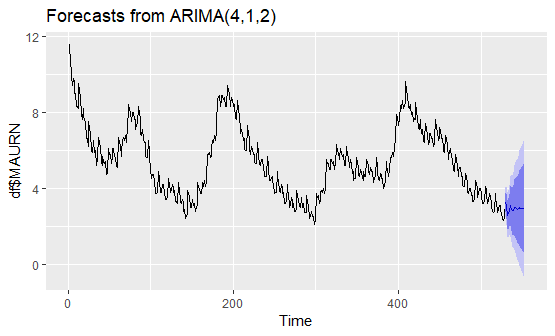

# Forecasting Monthly Unemployment Rate
The unemployment rate forecast is defined as the projected value for the number of unemployed people as a percentage of the labor force, where the latter consists of the unemployed plus those in paid or self-employment. Unemployed people are those who report that they are without work, that they are available for work, and that they have taken active steps to find work in the last four weeks.

# Project Objective

Forcast the Monthly Unemployment Rate for two years ago using ARIMA model.

# Dataset

The dataset contains the Monthly Unemployment Rate between January 1976
to January 2020.
The dataset have two columns and 529 rows.The first column is the date
column and the second one is the monthly unemployment rate.

# Project Procedures:
###   Box-Jenkins Approach

     ➤ Model Identification

     ➤ Model Estimation

     ➤ Model Checking

     ➤Forecasting
     
 # Final result
    

According to this time series model, the monthly unemployment rate
either remains the same or decrease slightly in the next two years.
